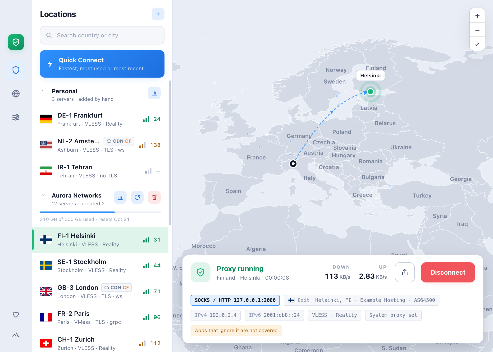
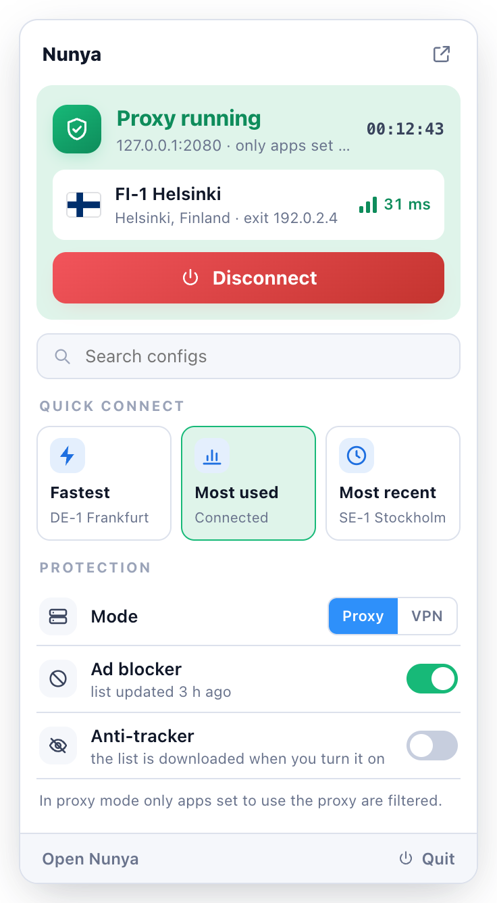
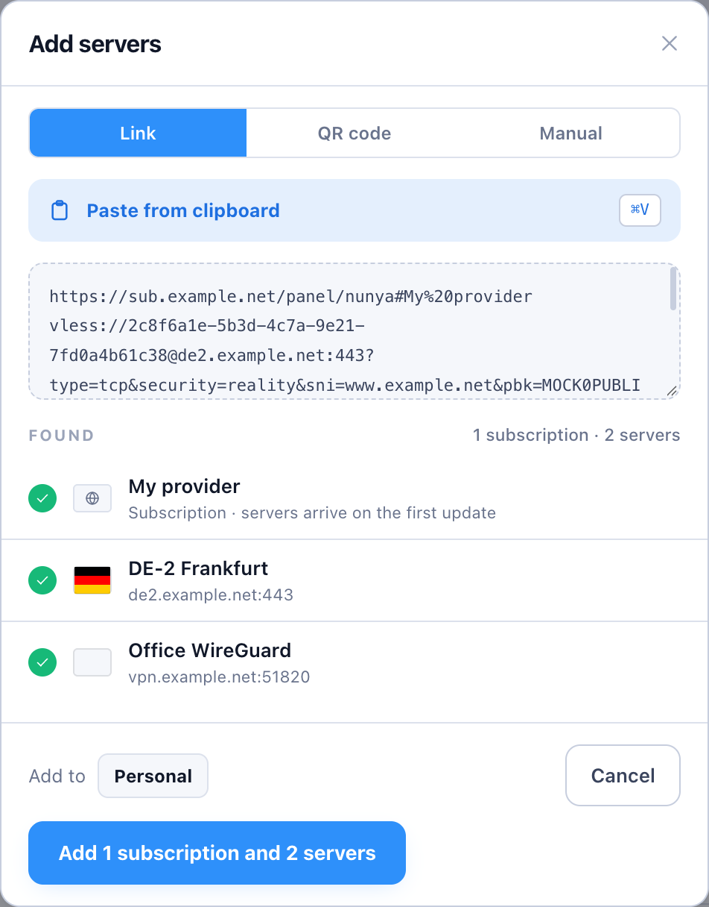
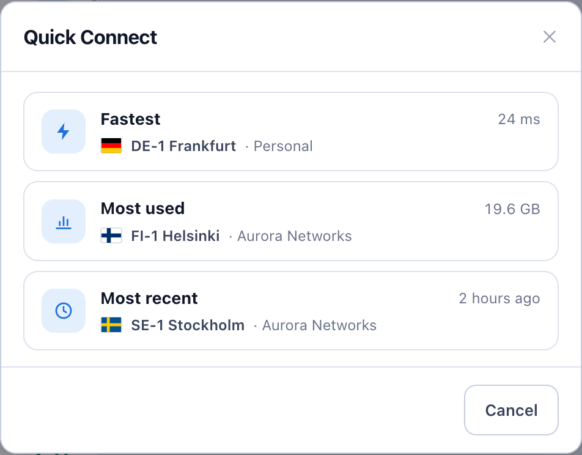
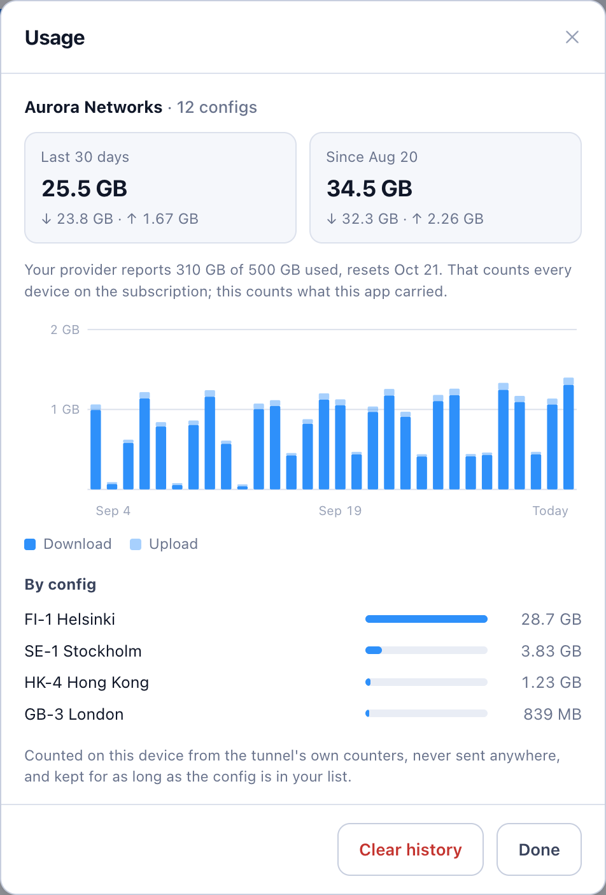
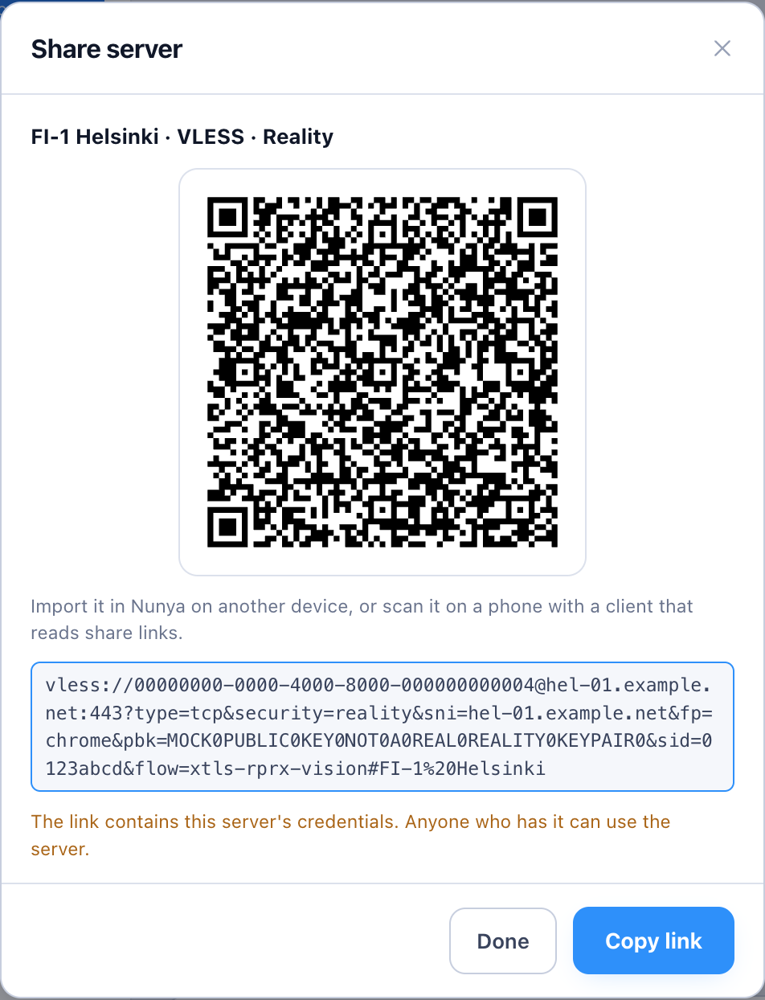
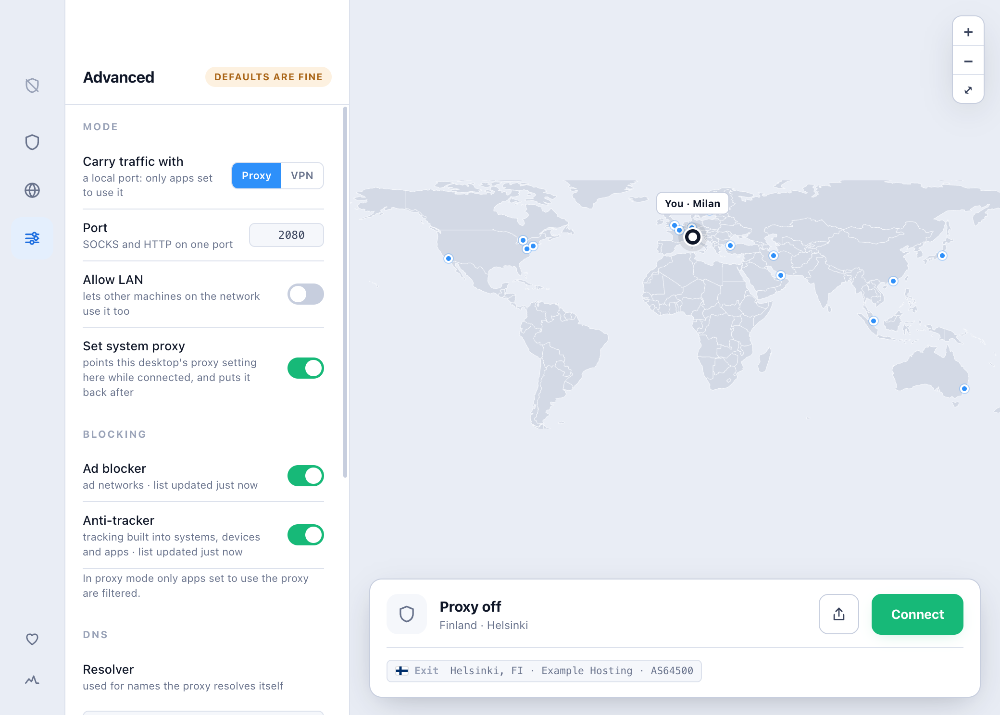
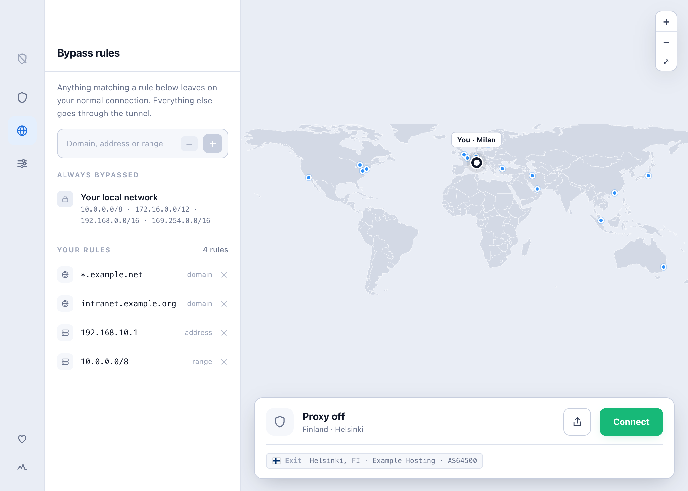

  

<h1 align="center">Nunya</h1>

  <strong>A VPN client that is safe, fast, reliable, secure and easy to use.</strong> 
  One app for your VPN and proxy configs, from a single link to a subscription of hundreds. 
  <a href="https://nunya-vpn.com">nunya-vpn.com</a>

  
  
  
  
  

  <picture>
    <source media="(prefers-color-scheme: dark)" srcset="docs/screenshots/main-dark.png">
    
  </picture>

Screenshots show made-up example servers.

## Why Nunya

Nunya connects you through the VPN and proxy servers you already have, whether that's links a
provider sent you, a subscription or a WireGuard config, and tells you plainly what it's doing.

| | |
| --- | --- |
| **Safe** | Nunya never claims more than it covers. In VPN mode the whole device goes through the tunnel; in proxy mode it tells you exactly which apps are covered, and which aren't. |
| **Fast** | Every server is tested end to end: how quickly it answers, and where your traffic really comes out. Quick Connect takes you to the fastest, the most used or the most recent. |
| **Reliable** | A server only counts as working if traffic actually gets through it, and the shield in the corner turns red when a connection is up but nothing comes out of it. |
| **Secure** | No account and no telemetry. Your servers stay on your device, the connection engine is a verified release, and the app and the engine check each other's identity. |
| **Easy to use** | Paste a link or a subscription, scan a QR code, and connect. |

## Features

- **Two ways to connect.** *VPN mode* carries the whole device. *Proxy mode* opens a local SOCKS and
  HTTP port, and can set it as your system proxy while you're connected (macOS, GNOME and KDE),
  putting your own settings back exactly when you disconnect.
- **Every kind of link, in one box.** VLESS, VMess, Trojan and WireGuard links; subscriptions,
  including Xray, sing-box and Clash configurations; import links; WireGuard configs; QR codes.
- **Servers you can trust at a glance.** Each server is tested for latency and located by where its
  traffic really exits, not by its name. Relays and CDN-fronted servers are marked as such, and a
  Cloudflare-fronted server shows the Cloudflare data center your network actually reaches it
  through — asked of Cloudflare, not guessed from a database.
- **A live map.** Your location, the servers, and the route your connection takes.
- **In the menu bar.** A shield in the macOS menu bar or the Linux top bar shows the connection at
  a glance, and connects or disconnects without opening the window.
- **Quick Connect.** Choose the fastest server, the one you use most, or the one you used last.
- **Usage.** How much each server and subscription has carried, day by day, beside what your
  provider reports.
- **Sharing.** Send a server to another device as a link or a QR code, or as a WireGuard config the
  official WireGuard apps can scan.
- **Bypass rules.** Keep chosen domains, addresses and ranges off the tunnel. Your local network
  always is.
- **Ad blocker and anti-tracker.** Refuse ad networks, and the tracking built into operating
  systems, devices and apps, while you're connected.
- **Light and dark**, following your system.

## A tour

### The main window

At launch Nunya shows its mark while it loads your servers, starts its engine and finds where you
are, then gets out of the way. It finds where you are again whenever your network changes.

The **server list** on the left groups your servers by where they came from: the ones you added
yourself, then each subscription, with its data allowance and when it was last updated. Each row
shows the server's flag and city (where its traffic really comes out), how it connects, and its
latency. The **map** shows you, your servers, and the route of your connection. The **status card**
at the bottom shows the connection, live traffic, and the public address the internet sees.

**To connect:** pick a server in the list (or a dot on the map) and press **Connect**. Connecting
and disconnecting take a few seconds; the card says what it is doing ("Setting the system proxy…")
and waits for it to finish before taking another click.

The icons down the left edge are the **status shield** (green connected, amber connecting, grey
off, red not working), then the server list, bypass rules, settings, support, and diagnostics.

### In the menu bar

<picture><source media="(prefers-color-scheme: dark)" srcset="docs/screenshots/popover-dark.png"></picture>

Nunya's mark sits in the macOS menu bar and the Linux top bar in the status shield's colours
(green connected, amber connecting, red not working, dimmed off), so you can see the connection
with the window closed.

On a **Mac**, click it to open a panel with everything you need day to day: the connection and a
big button to turn it on or off, the server you're on, **Quick Connect** (fastest, most used, most
recent), a search over your configs, the **Proxy / VPN** switch, and the **Ad blocker** and
**Anti-tracker**. Changing the server, the mode or a blocker while connected reconnects with the
change.

On **Linux**, click it for a menu with the selected server, the status, and **Connect** or
**Disconnect**.

Closing the window leaves the connection running: bring the window back from the panel or the menu
(or with the Dock icon on a Mac), and use **Quit** to stop.

On Linux the icon needs `libayatana-appindicator3`, and GNOME needs its AppIndicator extension.
Without them there is no icon, and closing the window quits Nunya as before.

### Adding servers

<picture><source media="(prefers-color-scheme: dark)" srcset="docs/screenshots/add-servers-dark.png"></picture>

Press **+** above the list and paste whatever your provider gave you. One paste can hold several
things at once, and Nunya sorts them before anything is added:

- **Share links**: `vless://`, `vmess://`, `trojan://`, `wireguard://`
- **Subscriptions**: an `https://` address, or a panel's *import to sing-box / Clash* link. Each
  gets its own group, which you can update later.
- **WireGuard configs**: the `[Interface]` / `[Peer]` text the WireGuard apps export

Anything Nunya can't run yet is named, with the reason, rather than silently dropped. The **QR
code** tab reads a code from a screenshot or an image, and **Manual** lets you fill in a server by
hand. New servers are tested and located straight away.

### Quick Connect

<picture><source media="(prefers-color-scheme: dark)" srcset="docs/screenshots/quick-connect-dark.png"></picture>

**Quick Connect**, at the top of the list, lets you choose by what matters this time:

- **Fastest**: the lowest latency among servers that passed their last test. If that result is
  old, the fastest few are tested again first.
- **Most used**: the server that carried the most data in the last 30 days.
- **Most recent**: the server you were last connected to.

### Checking servers

Servers are tested when they're added and whenever their subscription updates. To test one again,
use its **⋯** menu → **Check**. A test measures latency *and* makes a real request through the
server, so the flag shows where your traffic actually comes out. A server that relays through
another country shows both, as in "via NL". A dash means untested or unreachable; hover over it to
see why.

### Usage

<picture><source media="(prefers-color-scheme: dark)" srcset="docs/screenshots/usage-dark.png"></picture>

Press the chart button on a subscription, or choose **⋯ → Usage** on a server, to see what it has
carried: the last 30 days and all time, a daily chart, and, for a subscription, each server's
share. Where the provider reports your allowance, its figure is shown too. Usage is counted on your
device only, and is kept for as long as the server is in your list.

### Sharing a server

<picture><source media="(prefers-color-scheme: dark)" srcset="docs/screenshots/share-dark.png"></picture>

**⋯ → Share** shows a server as a QR code and a link, ready to scan on a phone or import in Nunya on
another device. A WireGuard server can also be shared as a WireGuard config, which the official
WireGuard apps scan. A share link contains the server's credentials, so share it only with people
you'd give access to.

### Settings: VPN or proxy

<picture><source media="(prefers-color-scheme: dark)" srcset="docs/screenshots/settings-dark.png"></picture>

- **Proxy mode** (the default) opens a SOCKS and HTTP port on your machine (2080 unless you change
  it). Apps you point at it go through the connection. Turn on **Set system proxy** to point your
  desktop's proxy setting at it while you're connected; your previous setting comes back when you
  disconnect. Apps that ignore the system proxy aren't covered, and Nunya says so.
- **VPN mode** carries all of the device's traffic through the tunnel. It needs system privileges.
  On macOS, the first Connect in VPN mode explains why and asks for your administrator password,
  once (and again after each update); Nunya must be in Applications for this. On Linux, installed
  from its package (`.deb`, `.rpm` or the Arch package), it asks for your password once
  through your system's own prompt (and again after each update).
- **Allow LAN** lets other devices on your network use the proxy. **DNS** sets the resolver used
  inside the connection.
- **Ad blocker** refuses ad networks (the `category-ads-all` list published by sing-box's authors).
  **Anti-tracker** refuses the tracking built into operating systems, devices and apps (HaGeZi's
  Native Tracker lists). Each list is downloaded when you turn its switch on, through the
  connection if you're connected, and kept up to date. Until a list has arrived its switch says
  it isn't blocking yet. In proxy mode they only filter apps that use the proxy.

Settings apply when you connect, so they're locked while a connection is running.

### Bypass rules

<picture><source media="(prefers-color-scheme: dark)" srcset="docs/screenshots/rules-dark.png"></picture>

Anything matching a bypass rule leaves on your normal connection: a domain (with or without
`*.`), an address, or a range such as `10.0.0.0/8`. Your local network is always bypassed.

### Diagnostics

The pulse icon at the bottom of the left edge shows the engine's log, the state of the connection
and your data, and the exact configuration a server would run with. It's the place to look first
when something doesn't connect, and what to include in a bug report.

## Supported protocols

| | |
| --- | --- |
| **Protocols** | VLESS, VMess, Trojan, WireGuard (Cloudflare WARP included) |
| **Transports** | TCP, WebSocket, gRPC, HTTP/2, HTTPUpgrade, QUIC, XHTTP |
| **Security** | TLS and Reality, with browser fingerprints and ALPN |
| **Subscriptions** | lists of share links (plain or base64), Xray, sing-box and Clash (JSON) configurations, and sing-box and Clash import links |
| **Coming** | Shadowsocks, Hysteria2, TUIC, SSH, AmneziaWG, proxy chains, and more ([roadmap](#roadmap)) |

XHTTP works with VLESS, VMess AEAD and Trojan using the bundled Xray engine, including TLS and
Reality. Import an XHTTP link (the legacy `splithttp` name is accepted), then edit its **Path**,
**Host**, **Mode** and **Extra (JSON)** in the server editor. Modes are `auto`, `packet-up`,
`stream-up` and `stream-one`. Extra supports `headers`, `xPaddingBytes`, `noGRPCHeader`,
`noSSEHeader`, `scMaxEachPostBytes`, `scMinPostsIntervalMs`, `scMaxBufferedPosts`,
`scStreamUpServerSecs` and `xmux`. Provider extras that repeat `host`, `path` or `mode` are
preserved; the main fields take precedence, as in Xray. Other extras, including separate
`downloadSettings`, are rejected with a reason. VLESS flow must be empty for XHTTP.

[View the XHTTP editor](docs/screenshots/xhttp-editor.png).

## Privacy and security

- **No account, no telemetry, no analytics.**
- **Your data stays on your device.** Servers, subscriptions and usage are stored in a file only
  your user account can read. A subscription address is treated as the credential it is.
- **A verified engine.** Nunya runs a pinned release of [nunya-core](https://github.com/nunyavpn/nunya-core),
  checked against its published checksums, and the app and the engine verify each other's
  identity when they connect.
- **Honest coverage.** The app only says you're protected when the whole device is in the tunnel.
- **Location lookups.** To place servers on the map, Nunya asks public IP-location services where
  your servers' addresses are, and where your own public address is, to draw your dot. The map
  itself is drawn from data inside the app; no map service is contacted.

## Installing

Nunya is in **beta**. Builds are published on the
[Releases](https://github.com/nunyavpn/nunya/releases) page, each with a `SHA256SUMS` to check your
download against. Every change ships as a new beta (marked *Pre-release*), so take the newest one;
stable versions, from 1.0 on, are marked *Latest*.

- **macOS** (Apple Silicon, macOS 12 or later): open the `.dmg` and drag Nunya into Applications.
  The beta isn't signed by an Apple Developer account yet, so the first time you open it, go to
  **System Settings → Privacy & Security** and choose **Open Anyway**.
- **Windows** (x86-64, Windows 10 or later): run `Nunya_<version>_x64-setup.exe`. The beta isn't
  code-signed yet, so SmartScreen may stop it the first time: choose **More info**, then
  **Run anyway**.
- **Linux** (x86-64):
  - **Debian, Ubuntu and their kin**: `sudo apt install ./Nunya_<version>_amd64.deb`.
  - **Fedora and its kin** (RHEL, openSUSE): `sudo dnf install ./Nunya-<version>-1.x86_64.rpm`.
  - **Arch, Manjaro and their kin**: `sudo pacman -U nunya-<version>-1-x86_64.pkg.tar.zst`. An AUR
    package (`nunya-bin`) will follow once AUR registration reopens.

  Your package manager updates Nunya; the app does not update itself on Linux. On ARM there are an
  `arm64.deb` and an `aarch64.rpm`.

This beta is built around **proxy mode**. VPN mode works on macOS after an administrator password
prompt, and on Windows after Windows' own prompt, which restarts Nunya as administrator (or start
it with **Run as administrator** to skip that). On Linux it works from the `.deb` or the Arch
package, after your system's password prompt.

### Updating

On macOS and Windows, Nunya looks for a new release a little after it starts and then every hour. When it finds one it
downloads it, checks its signature against the key built into the app, and tells you it is ready:
**Restart to update** installs it and opens the new version. It never restarts on its own, so a
connection you are using is not dropped for an update. Betas are offered too, unless you turn off
**Beta versions** under Advanced → Updates.

Updating works from the first version that has it; a copy older than that has to be replaced by
hand once. On macOS, VPN mode asks for your administrator password again after an update.

On Linux, your package manager updates Nunya (`apt`, `dnf`, `pacman`), not the app. VPN mode asks for your
password once more after each update, since the update replaces the tunnel engine.

## Roadmap

- More protocols: Shadowsocks, Hysteria2, TUIC, SSH, AmneziaWG, and more
- Proxy chains, routing rules and a built-in ad blocker
- VPN mode out of the box on every platform, with no administrator step
- Cloudflare WARP: create and register configs from the app
- On the server side: **nunya-server-core** (Docker), **nunya-cluster** (auto-scaling across nodes)
  and **nunya-server-panel** (config and user management)

Follow along, or suggest something, in the [issues](https://github.com/nunyavpn/nunya/issues).

## Contributing

Bug reports, ideas and pull requests are welcome. Building from source, running in development and
mock modes, tests, and how the app is put together are all in **[CONTRIBUTING.md](docs/CONTRIBUTING.md)**.

## Supporting Nunya

Nunya is free and open source. Donations are being set up, through two channels only: **Buy Me a
Coffee** and **crypto wallets**. They will be listed here and in the app's Support panel (the heart
in the left edge) once they are open.

Until then, and anywhere else afterwards, anyone asking for payment in Nunya's name is not us.

## License

Nunya is free software under the [GNU General Public License v3.0](LICENSE). It began as a fork of
[Throne](https://github.com/throneproj/Throne).
